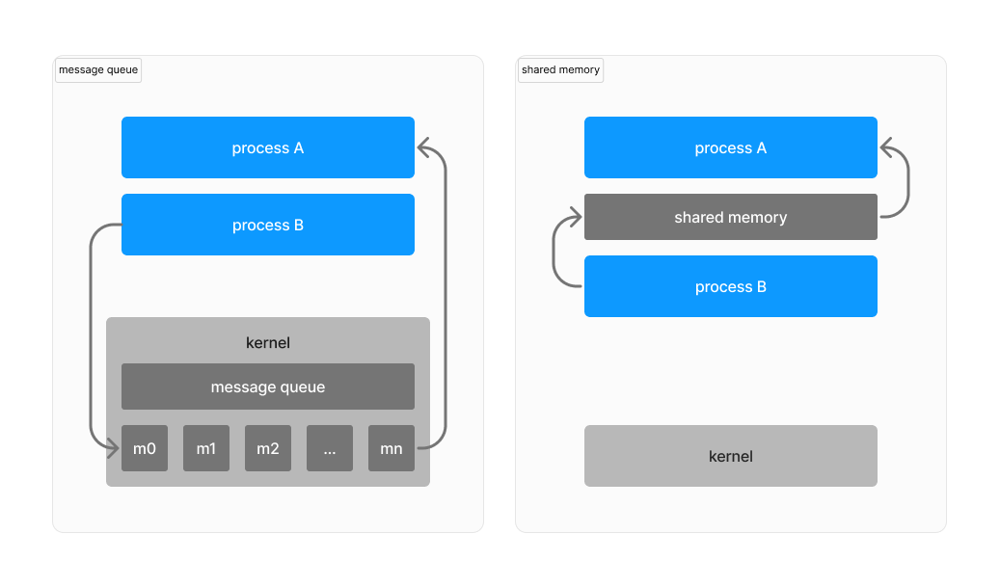

# Inter-process communication

Intriguing repository clone of Discord's RPC IPC communication channel.
I'm trying to delve into the reverse engineering and ingeniously clone the 
enigmatic pathways that facilitate communication in the Discord.

## What is IPC?

> IPC (inter-process communication) are the mechanisms provided by an operating system for processes to manage shared data. Typically, applications can use IPC, categorized as clients and servers, where the client requests data and the server responds to client requests.
>
> *- Wikipedia (https://en.wikipedia.org/wiki/Inter-process_communication)*

## Shared memory

Reference from [Linux kernel IPC](https://tldp.org/LDP/tlk/ipc/ipc.html) [System V](https://dwheeler.com/secure-programs/Secure-Programs-HOWTO/sysv-ipc.html):

> Shared memory allows one or more processes to communicate via memory that appears in all of their virtual address spaces.

(TBU)
